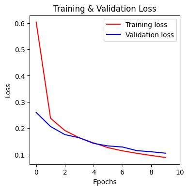

# Handwritten Digit Recognition using TensorFlow

This project implements a neural network using TensorFlow and Keras to classify handwritten digits from the MNIST dataset. The goal is to build and train a model capable of accurately recognizing digits (0-9) from images.

## Table of Contents

* [Project Overview](#project-overview)
* [Dataset](#dataset)
* [Technologies Used](#technologies-used)
* [Methodology](#methodology)
* [Model Architecture](#model-architecture)
* [Results](#results)
* [How to Run](#how-to-run)
* [Files in this Repository](#files-in-this-repository)
* [Future Work](#future-work)

## Project Overview

This notebook demonstrates the process of building, training, and evaluating a simple feedforward neural network for image classification on the classic MNIST dataset. It covers data loading, preprocessing, model definition, compilation, training, and evaluation, providing a foundational understanding of deep learning for image recognition.

## Dataset

The project utilizes the **MNIST (Modified National Institute of Standards and Technology) dataset**. The MNIST dataset is a large database of handwritten digits that is commonly used for training various image processing systems. It consists of:
* 60,000 training examples.
* 10,000 testing examples.
* Each example is a 28x28 pixel grayscale image of a handwritten digit (0-9).

## Technologies Used

* **Python**
* **NumPy**: For numerical operations, especially array manipulation.
* **Matplotlib**: For data visualization (displaying sample images, plotting training history).
* **TensorFlow**: The primary deep learning framework.
* **Keras**: High-level API for building and training neural networks (part of TensorFlow).
    * `Sequential` API for model construction.
    * `Dense` layers for the neural network.
* **Scikit-learn (sklearn)**:
    * `MinMaxScaler` (though direct division by 255 was used for normalization).
    * `train_test_split` for splitting data into validation and test sets.

## Methodology

The project follows a standard machine learning workflow for image classification:

1.  **Data Loading**: The MNIST dataset is loaded directly using `tf.keras.datasets.mnist.load_data()`.
2.  **Data Preprocessing**:
    * Images are reshaped from 28x28 pixel 2D arrays into 784-element 1D arrays, treating each pixel as a feature.
    * Pixel values (originally 0-255) are normalized by dividing by 255, scaling them to a range of 0 to 1.
3.  **Data Splitting**: The preprocessed data is split into training, validation, and testing sets to ensure robust model evaluation.
4.  **Model Building**: A `Sequential` Keras model is constructed with three `Dense` (fully connected) layers:
    * An input layer matching the 784 features.
    * Two hidden layers with ReLU activation (32 and 64 units, respectively).
    * An output layer with 10 units (for 10 classes, 0-9 digits) and a linear activation function (logits for `SparseCategoricalCrossentropy`).
5.  **Model Compilation**: The model is compiled using:
    * **Loss Function**: `tf.keras.losses.SparseCategoricalCrossentropy(from_logits=True)` suitable for multi-class classification with integer labels.
    * **Optimizer**: `tf.keras.optimizers.Adam(0.001)` for efficient weight updates.
    * **Metrics**: `accuracy` to monitor performance during training.
6.  **Model Training**: The model is trained for 10 epochs using the training data, with validation performed on a separate validation set.
7.  **Evaluation**: The model's performance (loss and accuracy) is tracked during training on both training and validation sets.

## Model Architecture

The neural network consists of the following layers:

Layer (type)----------------Output Shape--------------Param 

L1 (Dense)-------------------(None, 32)---------------25120

L2 (Dense)-------------------(None, 64)----------------2112

L3 (Dense)-------------------(None, 10)-----------------650

=================================================================

Total params: 27,882

Trainable params: 27,882

Non-trainable params: 0

## Results

After 10 epochs of training, the model achieved the following performance metrics:

* **Training Accuracy:** ~97.32%
* **Validation Accuracy:** ~96.68%
* **Training Loss:** ~0.0889
* **Validation Loss:** ~0.1052

The training process and convergence can be visualized by the loss curves below:

### Training and Validation Loss

These results indicate that the model is performing well on both seen and unseen data, demonstrating its ability to generalize.
